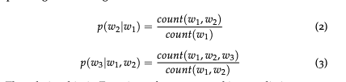
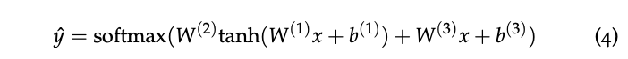
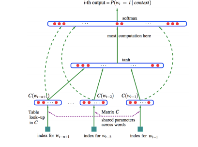
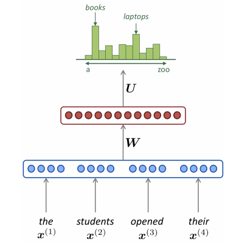
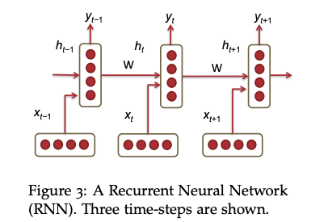
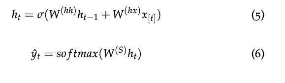

# Language Models
## Introduction

Language Models compute the probability of occurrence of a number of words in a particular sequence. Since the number of words comming before a wrod, varies depending on its location in the input document. The probability dostribution is usually conditioned on a window of n previous words rather than all previous words. The model will give higher scores to " the cat is small" compared to "small the is cat".

Notes: This joint probablity model is to learn the frequency the sequence words. For example, if "AABB" has the most common happens, then  given "A" the mostly like next three will be "ABB". This means the model is not really learn the word but the patterns.

## n-gram Language Models

To compute the probabilities, the count of each n-gram could be compared against the frequency of each word.  This is called an n-gram Language Model. The following equations show the relationship for bigram and trigram models.

Two main issues:
 * Sparsity problems with n-gram Language moldes
   - The numerator of equation (3). If the count is 0. The probability is 0. To solve this, a small delta could be added to the count for each word in the vocabulary. This is called `smoothing`.
   - For the denominator of equation (3), if w1 and w2 never happens, the denominator is 0. To solve this, we could condition on w2 alone. This is called `backoff`.
 * Storage problems with n-gram Language models
   - we know that we need to store rge count of n-grams we saw in the corpus.

# Window-based Neural Language Model

This model learns a `distributed representation of words`, along with the probability function for word sequences expressed in terms of these representations.
The model is 

.

The architecture is 

Note that, we need to process the sentences into window based data. That is (w1,w2,w3) and the label is w4. For (w1,w2,w3), lookup the embedding matrix to construct x. Then fit to the nn model. 

The simplified model is:

# RNN

Recurrent Neural Networks (RNN) are capableof conditioning the model on all previous wordsin the corpus. See the following architecture.

Note that, at which step, there are two inputs and two outputs. The one input is the carry-on from the previous step, which is used to memoery the long-term dependence. Another input is the current word to update the latest information. The two outputs are the carry-on to the next step and the prediction of current step.

See the following equations for more details.

Hence, we can see that the carry-on update is to mix the previous carry-on and the current input. The current output is only derived from the current carry-on.
